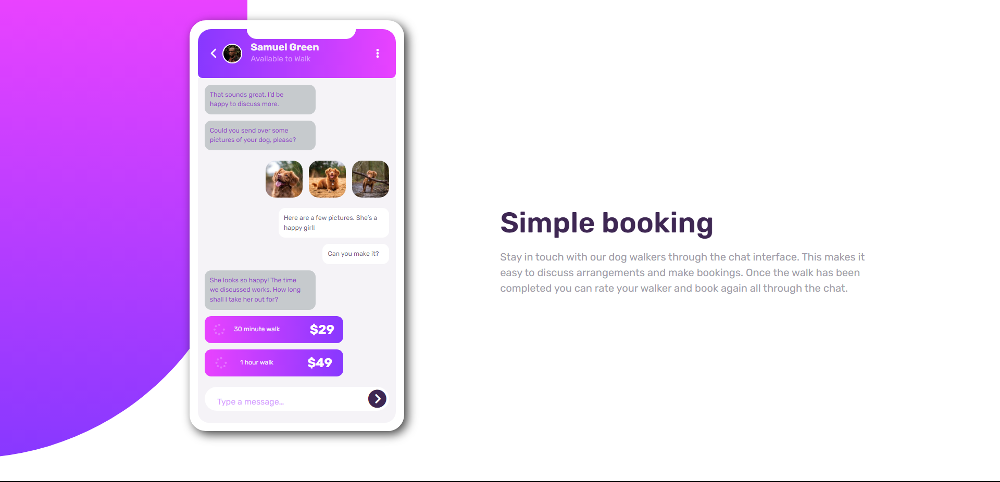
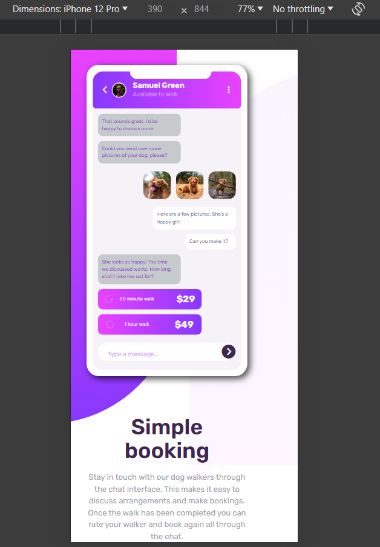

# Frontend Mentor - Chat app CSS illustration solution

This is a solution to the [Chat app CSS illustration challenge on Frontend Mentor](https://www.frontendmentor.io/challenges/chat-app-css-illustration-O5auMkFqY). Frontend Mentor challenges help you improve your coding skills by building realistic projects.

## Table of contents

- [Overview](#overview)
  - [The challenge](#the-challenge)
  - [Screenshot](#screenshot)
  - [Links](#links)
- [My process](#my-process)
  - [Built with](#built-with)
  - [What I learned](#what-i-learned)
  - [Continued development](#continued-development)
  - [Useful resources](#useful-resources)
- [Author](#author)

## Overview

### The challenge

Users should be able to:

- View the optimal layout for the component depending on their device's screen size
- **Bonus**: See the chat interface animate on the initial load

### Screenshot




### Links

- Solution URL: (https://github.com/hassanmoaa/chatapp-ui-illustration-FrontEndMentor.git)
- Live Site URL: (https://chatappuiillustration.netlify.app/)

### Built with

[](https://skillicons.dev)

### What I learned

I Completed a complex UI design pattern for the first time which wasn't too hard went smoothly and i learned about using ::before and ::after pseudo classes!

```
body::before {
    content: "";
    width: 265px;
    height: 90%;
    background: linear-gradient(180deg, var(--Light-Magenta), var(--Light-Violet));
    position: absolute;
    z-index: -1;
    left: -50px;
    border-radius: 0 0 500px 0;
}

body::after {
    content: "";
    width: 300px;
    height: 95%;
    background: linear-gradient(180deg, var(--Light-Magenta), var(--Light-Violet));
    position: absolute;
    z-index: -100;
    right: -150px;
    bottom: 0;
    border-radius: 0px 0px 500px 0;
    transform: rotate(180deg);
    opacity: 0.05;
}

```

### Continued development

- Full Stack Development

### Useful resources

- (https://developer.mozilla.org/)
- (https://www.w3schools.com)

## Author

- Frontend Mentor - [@hassanmoaa](https://www.frontendmentor.io/profile/hassanmoaa)
